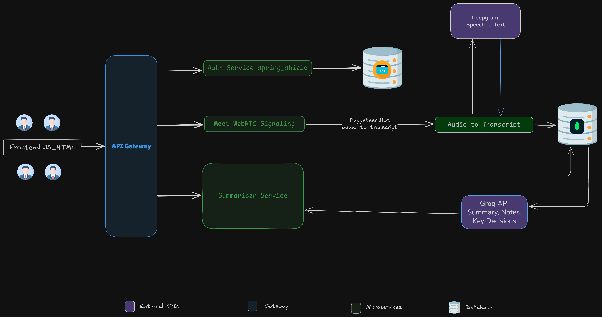

# Meetwise 🧠🎥

**Meetwise** is a modern AI-powered meeting platform designed for teams and professionals who value efficiency and clarity. It enables seamless **real-time video conferencing** using **WebRTC** and automatically generates **meeting summaries, key notes**, and highlights of **important decisions**.
## ✨ Features

- 🎥 **Real-time Video & Audio Conferencing**  
  Built on WebRTC, Meetwise enables high-quality Many to Many Meetings without any third-party dependencies.

- 🧠 **AI-Powered Meeting Summaries**  
  Automatically transcribes and summarizes meeting discussions using Deepgram's speech-to-text engine.

- 📝 **Action Items & Key Decision Extraction**  
  Highlights critical decisions, action items, and important moments from the conversation.

- 🤖 **Headless Bot Integration**  
  A Puppeteer-powered bot can automatically join meetings, record audio, and trigger summarization workflows.

- 🔐 **Secure by Design**  
  JWT-based authentication with Spring Security ensures all APIs and interactions are fully protected.

- 🧩 **Modular Microservice Architecture**  
  Services are split by responsibility (Gateway, Auth-Service, Summarizer, etc.) for scalability and maintainability.

- 📦 **Clean and Lightweight Frontend**  
  Built with vanilla JavaScript and HTML for fast performance and easy integration with the signaling server.

## 🧠 System Architecture
Here's an overview of how the Meetwise system works internally:


## 🛠 Tech Stack

| Category             | Technology                          | Purpose                                              |
|----------------------|--------------------------------------|------------------------------------------------------|
| **Backend**          | Spring Boot                          | Microservice-based backend architecture              |
|                      | Spring Security 6                    | Role-based access control and JWT authentication     |
|                      | WebSocket                            | Real-time signaling for WebRTC                       |
|                      | JWT (JSON Web Token)                 | Stateless API authentication                         |
|                      | **WebClient (Reactive)**             | Asynchronous, non-blocking HTTP communication        |
| **API Gateway**      | Spring Cloud Gateway                 | Centralized routing and authentication               |
| **Real-Time Comm**   | WebRTC                               | Peer-to-peer audio/video communication               |
|                      | STUN/TURN                            | NAT traversal support for WebRTC                     |
| **AI & Automation**  | Deepgram API                         | Real-time transcription of meeting audio             |
|                      | **Groq (LLM via LangChain4J)**       | Extracts summaries, key points, and decisions        |
|                      | Puppeteer                            | Headless bot to join and record meetings             |
| **Frontend**         | HTML, CSS, JavaScript                | Lightweight user interface                           |
|                      | Konva.js *(planned)*                | Whiteboard/canvas-based collaboration *(future)*     |
| **DevOps**           | Docker & Docker Compose *(planned)* | Containerization and microservice orchestration      |

## ⚙️ Reactive & Asynchronous Architecture

Meetwise leverages **Spring WebClient** for all inter-service and external HTTP calls, enabling non-blocking, reactive communication across the system.

- All internal service calls (e.g., to the summarizer) are handled asynchronously.
- Integration with **Deepgram** (for transcription) and **Groq** (for summary + action point extraction) is fully reactive using WebClient.
- This allows Meetwise to scale efficiently under concurrent user load, reducing blocking I/O and improving responsiveness.


## 🗂 Project Structure
    Meetwise Ai
    |
    |── api-gateway           # Central API Gateway (Spring Cloud Gateway)
    |── audio-to-transcript   # Puppeteer bot to join & record meetings
    |── meet                  # WebRTC signaling and meet backend
    |── spring-shield         # Auth service for login, roles, JWT
    └── summariser            # Transcription & summary (Deepgram + Groq)

    
    # Each folder represents a self-contained microservice following Spring Boot conventions
    
    .
## 🚀 Installation & Local Development
Follow these steps to set up MeetwiseAi locally on your machine.

### 🔧 Prerequisites

- Java 17+
- Maven
- Node.js (for Puppeteer bot)
- Deepgram API Key (for transcription)
- Groq API Key (for summarization via LLM)
- Web browser (Chrome preferred)

---

### 📁 Step-by-Step Setup

> Run each service in its own terminal window or IDE.

#### 1. Clone the Repository
```bash
git clone https://github.com/your-username/MeetwiseAi.git
cd MeetwiseAi
```

#### 2. Start API Gateway
```bash
cd api-gateway
./mvnw spring-boot:run
```

#### 3. Start Auth Service
```bash
cd ../spring-shield
./mvnw spring-boot:run
```

#### 4. Start Video Call Service
```bash
cd ../meet
./mvnw spring-boot:run
```

#### 5. Start the audio-to-transcript
```bash
cd ../audio-to-transcript
npm install
node index.js

./mvnw spring-boot:run
```

#### 6. Start Summariser Service
```bash
cd ../summariser
./mvnw spring-boot:run
```


## 📄 License

This project is licensed under the **MIT License**.

You are free to use, modify, and distribute this project with proper credit.  
See the [LICENSE](LICENSE) file for more details.

> ⚠️ This project is intended for educational and demo purposes only. Commercial use requires permission.


